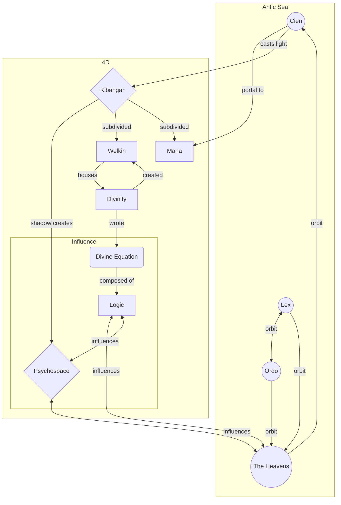

```mermaid
flowchart TB

subgraph q [Antic Sea]
Cien((Cien))
id2((The Heavens))
Lex((Lex))
Ordo((Ordo))
end


subgraph 4d [4D]
direction BT
d{Kibangan}
Welkin
Mana
Divinity
    subgraph u [Influence]
    c{Psychospace}
    id1
    Logic
    end
end

id1-- composed of -->Logic
Lex <-- orbit --> Ordo
Lex & Ordo -- orbit -->id2 -- orbit --> Cien
Cien-- portal to --> Mana
Cien-- casts light --> d -- shadow creates --> c <-- influences --> id2
d-- subdivided -->Welkin & Mana
Welkin-- houses -->Divinity
Logic<-- influences --> id2 & c
Divinity-- created --> Welkin
Divinity-- wrote -->id1(Divine Equation)

```

